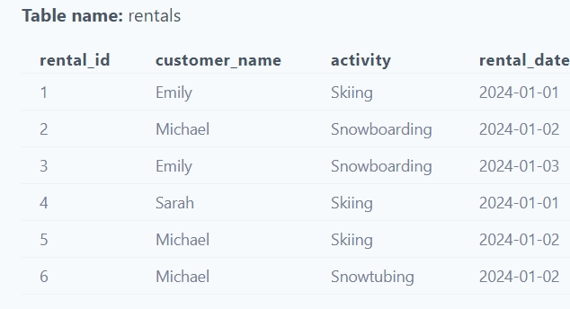

Today's Question: 
A ski resort company want to know which customers rented ski equipment for more than one type of activity (e.g., skiing and snowboarding). List the customer names and the number of distinct activities they rented equipment for.

Question level of difficulty: Medium 🎅🎅
